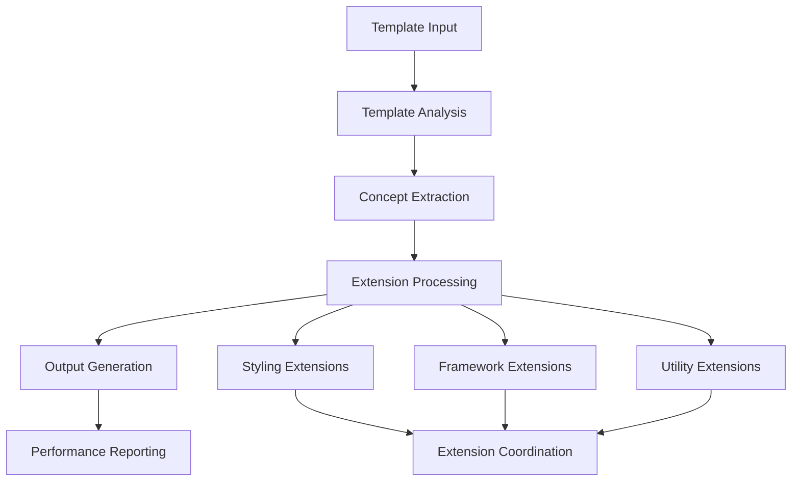

# Processing Pipeline Architecture

## Overview

The `ProcessingPipeline` is the central orchestrator of the JS Template Engine's concept-driven architecture. It manages template analysis, concept extraction, extension processing, and output generation with comprehensive error handling and performance tracking.

## Core Architecture

### ProcessingPipeline Class Structure

```typescript
export class ProcessingPipeline {
  private registry: ExtensionRegistry;
  private analyzer: TemplateAnalyzer;
  private errorCollector: ErrorCollector;
  
  // Advanced processors
  private componentPropertyProcessor: ComponentPropertyProcessor;
  private importProcessor: ImportProcessor;
  private scriptMergeProcessor: ScriptMergeProcessor;
  private componentNameResolver: ComponentNameResolver;
  private eventExtractor: EventExtractor;
  private stylingExtractor: StylingExtractor;
  private conceptValidator: ConceptValidator;
  private frameworkConsistencyChecker: FrameworkConsistencyChecker;
  private eventNormalizer: EventNormalizer;
  private performanceTracker: PerformanceTracker;
}
```

### Processing Flow



## Processing Methods

### 1. Basic Processing

The core `process()` method handles standard template processing:

```typescript
async process(
  template: TemplateNode[], 
  options: ProcessingOptions = {}
): Promise<ProcessingResult> {
  const startTime = Date.now();
  
  // 1. Extract concepts using analyzer
  const concepts = this.analyzer.extractConcepts(template);
  
  // 2. Process styling extension first (classes available for rendering)
  if (options.styling) {
    const stylingExtension = this.registry.getStyling(options.styling);
    const styleResult = stylingExtension.processStyles(concepts.styling);
    concepts.styling = styleResult.updatedStyling;
  }
  
  // 3. Process framework extension (uses generated classes)
  if (options.framework) {
    const frameworkExtension = this.registry.getFramework(options.framework);
    frameworkExtension.processEvents(concepts.events);
    frameworkExtension.processConditionals(concepts.conditionals);
    frameworkExtension.processIterations(concepts.iterations);
    frameworkExtension.processSlots(concepts.slots);
    frameworkExtension.processAttributes(concepts.attributes);
    
    output = frameworkExtension.renderComponent(concepts, context);
  }
  
  // 4. Process utility extensions last
  if (options.utilities) {
    for (const utilityKey of options.utilities) {
      const utilityExtension = this.registry.getUtility(utilityKey);
      concepts = utilityExtension.process(concepts);
    }
  }
  
  return this.createProcessingResult(output, concepts, performance);
}
```

### 2. Advanced Processing

The `processAdvanced()` method provides comprehensive processing with enhanced features:

```typescript
async processAdvanced(
  template: TemplateNode[],
  options: ProcessingOptions = {}
): Promise<ProcessingResult> {
  
  // Step 1: Component properties processing
  if (options.componentDefinition) {
    const componentProperties = this.componentPropertyProcessor
      .mergeComponentProperties(options.componentDefinition, renderOptions);
  }
  
  // Step 2: Enhanced concept extraction
  if (options.extraction?.useEventExtractor) {
    const eventResult = this.eventExtractor.extractEvents(template, options);
    concepts.events = eventResult.events;
  }
  
  if (options.extraction?.useStylingExtractor) {
    const stylingResult = this.stylingExtractor.extractStyling(template, options);
    concepts.styling = stylingResult.styling;
  }
  
  // Step 3: Event normalization
  if (options.extraction?.normalizeEvents) {
    const normalizedEvents = this.eventNormalizer.normalizeEvents(
      concepts.events, 
      normalizationOptions
    );
    concepts.events = normalizedEvents;
  }
  
  // Step 4: Concept validation
  if (options.extraction?.validateConcepts) {
    const validation = this.conceptValidator.validateComponent(concepts, options);
  }
  
  // Step 5: Framework consistency checking
  if (options.validation?.enableCrossConceptValidation) {
    const consistencyReport = this.frameworkConsistencyChecker
      .checkConsistency(concepts);
  }
  
  // Step 6: Process with base pipeline
  const baseResult = await this.process(template, options);
  
  return this.createEnhancedResult(baseResult, validation, consistencyReport);
}
```

### 3. Auto-Enhancement Processing

Intelligent processing that automatically enables advanced features based on template complexity:

```typescript
async processWithAutoEnhancement(
  template: TemplateNode[],
  options: ProcessingOptions = {}
): Promise<ProcessingResult> {
  
  const enhancedOptions: ProcessingOptions = {
    ...options,
    extraction: {
      useEventExtractor: this.shouldUseEventExtractor(template),
      useStylingExtractor: this.shouldUseStylingExtractor(template),
      normalizeEvents: !!options.framework,
      validateConcepts: true
    }
  };
  
  return this.processAdvanced(template, enhancedOptions);
}

private shouldUseEventExtractor(template: TemplateNode[]): boolean {
  const templateStr = JSON.stringify(template);
  return templateStr.includes('@') || 
         templateStr.includes('on:') || 
         templateStr.includes('onClick');
}
```

## Extension Processing Order

The processing pipeline follows a carefully designed order to ensure proper extension coordination:

### 1. Styling Extensions (First)

Styling extensions process first to generate classes that framework extensions can use:

```typescript
// Process styling extension first
if (options.styling) {
  const stylingExtension = this.registry.getStyling(options.styling);
  const styleResult = stylingExtension.processStyles(concepts.styling);
  
  // Update concepts with generated classes
  processedConcepts.styling = styleResult.updatedStyling;
}
```

**Why First**: Generated CSS classes need to be available when framework extensions render elements.

**Example**: BEM extension generates `.card__header--primary` which React extension uses in `className` attribute.

### 2. Framework Extensions (Second)

Framework extensions process concepts and render components:

```typescript
if (options.framework) {
  const frameworkExtension = this.registry.getFramework(options.framework);
  
  // Process each concept type
  frameworkExtension.processEvents(processedConcepts.events);
  frameworkExtension.processConditionals(processedConcepts.conditionals);
  frameworkExtension.processIterations(processedConcepts.iterations);
  frameworkExtension.processSlots(processedConcepts.slots);
  frameworkExtension.processAttributes(processedConcepts.attributes);
  
  // Render final component using processed concepts
  output = frameworkExtension.renderComponent(processedConcepts, context);
}
```

**Why Second**: Uses classes generated by styling extensions and produces framework-specific output.

### 3. Utility Extensions (Last)

Utility extensions perform post-processing operations:

```typescript
if (options.utilities?.length) {
  for (const utilityKey of options.utilities) {
    const utilityExtension = this.registry.getUtility(utilityKey);
    processedConcepts = utilityExtension.process(processedConcepts);
  }
}
```

**Why Last**: Operates on fully processed concepts and generated output.

## Performance Tracking

### Execution Timing

The pipeline tracks performance at multiple levels:

```typescript
private timeExtension(fn: () => void): number {
  const start = process.hrtime.bigint();
  fn();
  const end = process.hrtime.bigint();
  return Math.max(1, Number((end - start) / 1000000n)); // Convert to milliseconds
}

// Usage
extensionTimes[options.framework] = this.timeExtension(() => {
  frameworkExtension.processEvents(concepts.events);
  frameworkExtension.processConditionals(concepts.conditionals);
  // ... other processing
});
```

### Performance Metadata

Processing results include comprehensive performance data:

```typescript
interface ProcessingResult {
  output: string;
  errors: ErrorCollector;
  performance: {
    totalTime: number;
    extensionTimes: Record<string, number>;
  };
  metadata: {
    processingTime: number;
    extensionsUsed: string[];
    conceptsFound: {
      events: number;
      styling: boolean;
      conditionals: number;
      iterations: number;
      slots: number;
      attributes: number;
    };
  };
}
```

## Error Handling

### Multi-Level Error Collection

The pipeline uses hierarchical error collection:

```typescript
// Base error collector for general processing
private errorCollector: ErrorCollector;

// Advanced error collector for enhanced processing
private advancedErrorCollector: ErrorCollector;

// Merge errors from both collectors
private mergeErrorCollectors(
  baseErrors: ErrorCollector,
  advancedErrors: ErrorCollector
): ErrorCollector {
  const merged = new ErrorCollector();
  
  baseErrors.getErrors().forEach(error => merged.addError(error));
  advancedErrors.getErrors().forEach(error => merged.addError(error));
  
  return merged;
}
```

### Graceful Degradation

The pipeline handles errors gracefully without stopping processing:

```typescript
try {
  frameworkExtension.processEvents(processedConcepts.events);
} catch (error) {
  this.errorCollector.addError({
    message: `Framework processing failed: ${error.message}`,
    nodeId: 'root',
    extension: options.framework,
    severity: 'error'
  });
  // Continue processing other concepts
}
```

### Warning System

Non-critical issues generate warnings without failing the build:

```typescript
if (!options.framework && template.length > 0) {
  this.errorCollector.addWarning(
    'No framework specified for processing',
    'root',
    'pipeline'
  );
  output = ''; // Return empty output but don't fail
}
```

## Advanced Features

### 1. Component Property Processing

Sophisticated component property merging:

```typescript
const componentProcessor = new ComponentPropertyProcessor({
  script: { mode: 'merge', includeComments: true },
  props: { mode: 'merge', conflictResolution: 'warn' },
  imports: { mode: 'merge', deduplication: true, grouping: true }
});

const result = componentProcessor.mergeComponentProperties(
  definition,
  renderOptions
);
```

### 2. Event Normalization

Cross-framework event normalization:

```typescript
const normalizedEvents = this.eventNormalizer.normalizeEvents(
  concepts.events,
  {
    framework: 'react',
    preserveModifiers: true,
    validateEvents: true
  }
);
```

### 3. Concept Validation

Comprehensive concept validation with plugins:

```typescript
const validation = this.conceptValidator.validateComponent(
  concepts,
  {
    framework: 'react',
    checkAccessibility: true,
    checkPerformance: true,
    checkBestPractices: true,
    enableCrossConceptValidation: true
  }
);
```

## Extension Legacy Support

The pipeline maintains backward compatibility with legacy extensions:

```typescript
// Process legacy extensions array
if (options.extensions?.length) {
  for (const extensionKey of options.extensions) {
    // Auto-map to specific extension types
    const stylingExtension = this.registry.getStyling(extensionKey);
    if (stylingExtension && !options.styling) {
      options.styling = extensionKey;
    }
    
    const utilityExtension = this.registry.getUtility(extensionKey);
    if (utilityExtension) {
      if (!options.utilities) options.utilities = [];
      options.utilities.push(extensionKey);
    }
  }
}
```

## Template Issue Detection

The pipeline analyzes templates for common issues:

```typescript
private checkForTemplateIssues(template: TemplateNode[]): void {
  for (const node of template) {
    if (node.type === 'if' && !node.condition) {
      this.errorCollector.addWarning(
        'Conditional node missing required condition property',
        'template-analysis',
        'analyzer'
      );
    }
    
    if (node.type === 'for' && (!node.items || !node.item)) {
      this.errorCollector.addWarning(
        'Iteration node missing required items or item properties',
        'template-analysis',
        'analyzer'
      );
    }
  }
}
```

## Performance Characteristics

Based on current testing and benchmarks:

- **Average processing time**: 1-15ms for typical templates
- **Extension coordination overhead**: < 1ms per extension
- **Memory efficiency**: Concept reuse minimizes allocations
- **Scalability**: Linear performance with template complexity
- **Error handling**: Zero-overhead when no errors occur

## Future Enhancements

The pipeline architecture supports upcoming features:

1. **Parallel Processing**: Independent concepts can be processed concurrently
2. **Caching Layer**: Concept caching for repeated template processing
3. **Streaming Processing**: Support for large template processing
4. **Plugin System**: Dynamic loading of processing plugins
5. **Debug Mode**: Detailed processing step visualization

---

*The ProcessingPipeline represents the heart of the concept-driven architecture, orchestrating all aspects of template processing with optimal performance and comprehensive error handling.*