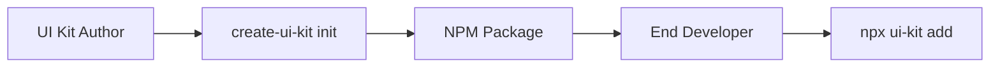

# 🎨 Create UI Kit

> **Create framework-agnostic UI kits from a single source of truth**

A CLI tool for authors to create and consumers to use UI component libraries that work across React, Vue, and other frameworks.

## 📖 Overview

Create UI Kit enables a complete **Author → NPM → Consumer** workflow:

- **Authors** define components once in JSON/TypeScript templates
- **Generate** React, Vue components from one definition  
- **Publish** as standard NPM packages with interactive CLI tools
- **Consumers** selectively add components to their projects



## 🚀 Quick Start

### For UI Kit Authors

Create a new UI kit project:

```bash
npx create-ui-kit init my-design-system
cd my-design-system
pnpm install
pnpm build
```

This scaffolds a complete project with:
- Sample components (button, navigation)
- Multi-framework build configuration
- Consumer CLI for end users
- Documentation generation

### For UI Kit Consumers

Add components from a published UI kit:

```bash
npx @company/design-system add
# Interactive CLI guides you through:
# - Framework selection (React/Vue)
# - Styling approach (CSS files, SCSS files, or inline styles)
# - Component selection
# - File placement
```

## 🏗️ Author Workflow

### 1. Initialize Project

```bash
npx create-ui-kit init my-ui-kit
```

**Interactive prompts:**
- Project name and metadata
- Target frameworks (React, Vue)
- Styling approaches (CSS files, SCSS files, inline styles)
- Optional BEM methodology for class naming
- TypeScript support

### 2. Project Structure

```
my-ui-kit/
├── src/
│   ├── components/           # Component templates
│   │   ├── button.json
│   │   └── navigation.json
│   ├── cli.ts               # Consumer CLI
│   └── utilities/           # Documentation & build tools
├── dist/                    # Pre-built components
│   ├── react/
│   └── vue/
├── create-ui-kit.config.js  # Capabilities configuration
├── package.json             # With proper exports & CLI script
└── README.md               # Auto-generated documentation
```

### 3. Component Templates

Define components once in JSON with framework-specific extensions:

```json
{
  "component": {
    "name": "Button",
    "props": {
      "children": "React.ReactNode",
      "onClick": "() => void",
      "variant": "\"primary\" | \"secondary\""
    }
  },
  "template": [
    {
      "tag": "button",
      "attributes": {
        "type": "button"
      },
      "children": [
        {
          "type": "text",
          "content": "Button Text"
        }
      ],
      "extensions": {
        "react": {
          "expressionAttributes": {
            "onClick": "props.onClick",
            "className": "props.variant === 'primary' ? 'btn btn-primary' : 'btn btn-secondary'"
          }
        },
        "vue": {
          "expressionAttributes": {
            "@click": "onClick",
            ":class": "`btn btn-${variant}`"
          }
        },
        "bem": {
          "block": "button",
          "modifiers": ["{{variant}}"]
        }
      }
    }
  ]
}
```

### 4. Configuration

Control capabilities per component in `create-ui-kit.config.js`:

```js
export default {
  name: '@company/design-system',
  version: '1.0.0',
  capabilities: {
    frameworks: ['react', 'vue'],
    styling: ['css', 'scss', 'inline'],
    typescript: true,
  },
  components: {
    button: {
      frameworks: ['react', 'vue'], // Available frameworks
      styling: ['css', 'scss'],     // Available styling options for this component
    },
  },
};
```

### 5. Build & Publish

```bash
pnpm build      # Generate all framework variants
pnpm build:docs # Generate documentation
npm publish     # Publish to NPM
```

## 👥 Consumer Workflow

### 1. Discover & Install

```bash
npm install @company/design-system
# or
yarn add @company/design-system
```

### 2. Interactive Component Selection

```bash
npx @company/design-system add
```

**The CLI guides you through:**

1. **Framework Selection**: React or Vue
2. **Styling Approach**: CSS files, SCSS files, or inline styles
3. **Capability Filtering**: Only compatible combinations shown
4. **Component Selection**: Multi-select from available components
5. **File Placement**: Choose output directory

### 3. Generated Output

Components are generated directly in your project:

```
your-project/
├── src/
│   └── components/
│       └── ui/              # Generated components
│           ├── Button.tsx   # React component
│           ├── Button.scss  # Styling
│           └── index.ts     # Exports
└── package.json            # Updated with dependencies
```

### 4. File Conflict Handling

When files already exist, choose from:
- **View diff**: See exactly what would change
- **Merge**: Combine changes intelligently  
- **Backup**: Create `.backup` files before overwriting
- **Skip**: Leave existing files unchanged

## ⚙️ Advanced Features

### Error Handling & Validation

Create UI Kit provides comprehensive error handling:

```bash
✅ Dependency validation with workspace detection
✅ Component template validation
✅ Configuration validation with helpful messages
✅ File conflict detection and resolution
✅ Cross-platform compatibility
```

### Dependency Management

Automatically handles workspace dependencies during development:

```bash
🔍 Validating project dependencies...

📦 Missing Dependencies Detected
🚨 Workspace Dependencies Issue:
The generated project references workspace packages that aren't published to NPM yet.

💡 Creating development-friendly package.json with file: paths...
✅ Development package.json created
```

### Documentation Generation

Auto-generates comprehensive documentation:

- **Component API** - Props, types, descriptions
- **Usage Examples** - For each framework/styling combination
- **Live Previews** - Generated component samples
- **Migration Guides** - Best practices

## 🧪 Testing

The project includes comprehensive testing:

- **57 unit tests** - Validation logic, error handling
- **27 integration tests** - End-to-end workflows
- **Coverage reporting** - 100% on critical validation logic

```bash
pnpm test              # Run all tests
pnpm test:coverage     # Generate coverage report
pnpm test:watch        # Watch mode for development
```

## 📝 Commands Reference

### Author Commands

```bash
npx create-ui-kit init [project-name]  # Initialize new UI kit
npx create-ui-kit init --help          # Show help
```

### Consumer Commands (in generated UI kits)

```bash
npx your-ui-kit add                     # Add components interactively
npx your-ui-kit add --help              # Show help
```

### Build Commands (in UI kit projects)

```bash
pnpm build                              # Build all framework variants
pnpm build:cli                          # Build consumer CLI only
pnpm build:docs                         # Generate documentation only
pnpm dev                                # Watch mode for development
pnpm clean                              # Clean build artifacts
```

## 🎯 Use Cases

### Design System Teams
- Create once, use everywhere
- Consistent components across frameworks
- Centralized maintenance and updates
- Interactive consumer experience

### Component Library Authors
- Reduce maintenance burden
- Support multiple frameworks from single codebase
- Built-in documentation and examples
- NPM distribution with CLI tools

### Frontend Developers  
- Discover components interactively
- Copy and customize vs import
- Framework flexibility
- Conflict-free integration

## 🔧 Requirements

- **Node.js** 16+ (recommended: 18+)
- **Package Manager** - npm, yarn, or pnpm
- **TypeScript** (optional but recommended)

## 🤝 Integration

### With Build Tools
- **Vite** - Works out of the box
- **Webpack** - Standard ES module imports
- **Next.js** - Compatible with App Router
- **Nuxt** - Vue component integration

### With Styling Solutions
- **CSS/SCSS** - Separate stylesheet files
- **Inline styles** - Component attribute styling  
- **BEM methodology** - Optional class naming convention
- **CSS Modules** - Compatible with generated stylesheets

## 📚 Related Documentation

- [JS Template Engine Core](../core/README.md) - Template syntax and extensions
- [React Extension](../extension-react/README.md) - React-specific features  
- [Vue Extension](../extension-vue/README.md) - Vue component generation
- [BEM Extension](../extension-bem/README.md) - BEM methodology support

## 🆘 Troubleshooting

### Common Issues

**Q: "Command not found: create-ui-kit"**
```bash
# Make sure you're using npx:
npx create-ui-kit init my-project
# Not: create-ui-kit init my-project
```

**Q: "Missing dependencies in generated project"**
```bash
# The tool automatically detects and fixes workspace dependencies
# Follow the on-screen guidance for development setup
```

**Q: "Components not generating correctly"**
```bash
# Check template validation:
pnpm build --verbose
# View detailed error messages and suggestions
```

### Getting Help

- **Issues**: [GitHub Issues](https://github.com/djurnamn/js-template-engine/issues)
- **Discussions**: [GitHub Discussions](https://github.com/djurnamn/js-template-engine/discussions)
- **CLI Help**: `npx create-ui-kit init --help`

## 📄 License

MIT - see [LICENSE](../../LICENSE) for details.

---

**Built with [JS Template Engine](https://github.com/djurnamn/js-template-engine)** ⚡